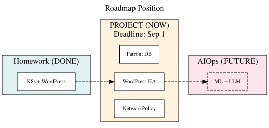
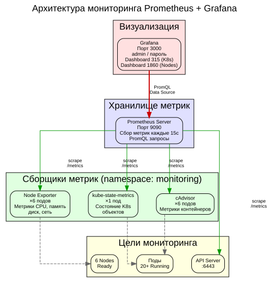
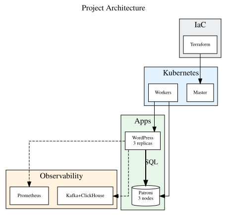
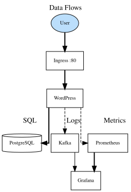
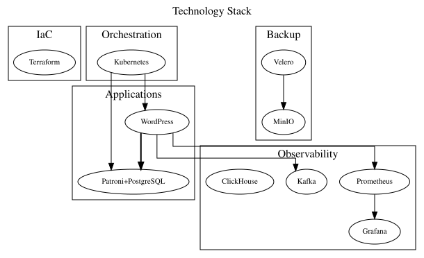
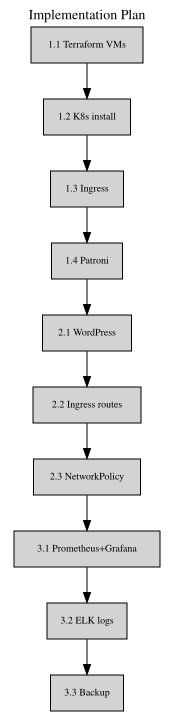
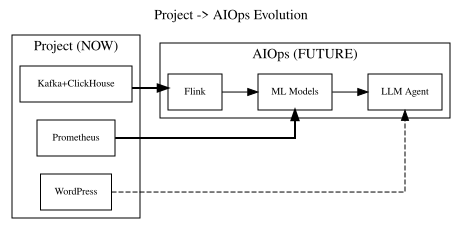

# 🚀 Kubernetes Production Cluster + Проектная работа

**Отказоустойчивый кластер для высоконагруженных веб-сервисов**

---

## 📋 Содержание

1. [Дорожная карта проекта](#дорожная-карта-проекта)
2. [Архитектура](#архитектура)
3. [Процесс развертывания](#процесс-развертывания)
4. [Сетевая архитектура и DNS](#сетевая-архитектура-и-dns)
5. [Бэкапирование: Velero + MinIO + NFS](#бэкапирование-velero--minio--nfs)
6. [Мониторинг: Prometheus + Grafana](#мониторинг-prometheus--grafana)
7. [Проектная работа](#проектная-работа)
8. [Проверка работы](#проверка-работы)
9. [Структура репозитория](#структура-репозитория)
10. [Трудности и решения](#трудности-и-решения)

---

## Дорожная карта проекта

### Схема: Место проекта в общей дорожной карте



**Описание:** Проектная работа — это мост между выполненным домашним заданием по Kubernetes и будущей AIOps-системой для анализа логов. Она объединяет компоненты из предыдущих ДЗ (K8s, Patroni, Kafka, Terraform) в единую отказоустойчивую систему.

### Этапы развития

| Этап | Срок | Цель | Статус |
|------|------|------|--------|
| **ДЗ** | Май-Июнь 2026 | K8s + WordPress + Бэкап + Мониторинг | ✅ Выполнено |
| **Проект** | Июнь-Август 2026 | Отказоустойчивый кластер (Patroni, NetworkPolicy, ELK, IaC) | 🔄 В процессе |
| **AIOps** | Сентябрь 2026 - Июнь 2027 | ML + LLM для анализа логов | 📅 Планируется |

### Что уже сделано (ДЗ)

| Компонент | Статус |
|-----------|--------|
| K8s кластер (6 узлов) | ✅ Ready |
| Calico CNI | ✅ ipipMode: Always |
| WordPress + MariaDB | ✅ Running |
| Velero + MinIO + PVC | ✅ Completed |
| Prometheus + Grafana | ✅ Dashboard 315, 1860 |
| NFS внешний бэкап | ✅ skhome01 |

### Что нужно сделать (Проектная работа)

| Компонент | Приоритет | Статус |
|-----------|----------|--------|
| Patroni + PostgreSQL (3 узла) | 🔴 Критично | ❌ |
| NetworkPolicy | 🔴 Критично | ❌ |
| Ingress для WordPress | 🟡 Важно | ⚠️ Частично |
| Terraform + Proxmox | 🟡 Важно | ❌ |
| Filebeat + Kafka + ClickHouse | 🟡 Важно | ❌ |
| pgBackRest | 🟡 Важно | ❌ |
| AlertManager | 🟢 Желательно | ❌ |
| Ansible | 🟢 Желательно | ❌ |

---

## Архитектура

### Схема: Общая архитектура кластера


**Описание:** Кластер развернут на гипервизоре Proxmox VE 9.2 с ZFS. Состоит из 6 узлов: 3 master (control plane) для отказоустойчивости API и etcd, 3 worker для размещения рабочих нагрузок. Все узлы соединены через Calico CNI с IP-in-IP туннелями. Сервисы распределены по namespace'ам: wordpress, backup, velero, monitoring. Для внешнего хранения бэкапов используется NFS сервер на skhome01.

### Схема: Процесс развертывания


**Описание:** Проект разворачивался в 4 этапа. На первом этапе подготовлен гипервизор с ZFS mirror для защиты данных ВМ. Второй этап — клонирование 6 ВМ из шаблона Ubuntu 24.04 с Cloud-init. Третий этап — инициализация Kubernetes с ручной настройкой etcd. Четвертый этап — установка сервисов: Calico CNI, WordPress, Velero, Prometheus.

---

## Сетевая архитектура и DNS

### Схема: Calico Network


**Описание:** Calico использует IP-in-IP туннели для инкапсуляции трафика между узлами. Все поды получают IP из сети 10.244.0.0/16, сервисы — из 10.96.0.0/12. Calico поддерживает NetworkPolicy для безопасности.

### Схема: DNS разрешение


**Описание:** CoreDNS работает как Service (10.96.0.10:53). Приложения с glibc (curl, Velero, WordPress) корректно разрешают имена через search-домены из /etc/resolv.conf. Alpine-образы (nslookup) не используют search-домены, что приводило к ошибочному выводу о неработоспособности DNS.

---

## Бэкапирование: Velero + MinIO + NFS

### Схема: Поток бэкапа


**Описание:** Velero создает бэкапы ресурсов Kubernetes и сохраняет их в MinIO — S3-совместимое объектное хранилище. MinIO использует PVC (local-storage) для постоянного хранения. Для защиты от полной потери Proxmox бэкапы копируются на внешний NFS сервер (skhome01) через Python/boto3.

**Команды:**
```bash
# Создание бэкапа
velero backup create wp-backup --include-namespaces wordpress

# Просмотр бэкапов
velero backup get

# Полный бэкап на NFS
ssh ubuntu@192.168.0.132 "sudo mount -t nfs 192.168.0.107:/srv/nfs/velero-backup /mnt/nfs-velero"
```

---

## Мониторинг: Prometheus + Grafana

### Схема: Архитектура мониторинга



**Описание:** Prometheus собирает метрики с Node Exporter (системные), kube-state-metrics (состояние K8s), cAdvisor (контейнеры) и API Server. Grafana визуализирует метрики через дашборды: Dashboard 315 (Kubernetes Cluster), Dashboard 1860 (Node Exporter Full).

**Доступ:**
- **Grafana:** http://192.168.0.132:3000
- **Логин:** admin
- **Пароль:** см. `kubectl get secret grafana -n monitoring -o jsonpath="{.data.admin-password}" | base64 --decode`

**Установка:**
```bash
helm install prometheus prometheus-community/prometheus -n monitoring
helm install grafana grafana/grafana -n monitoring
```

---

## Проектная работа

### Схема: Архитектура проектной работы



**Описание:** Проектная работа развивает базовый кластер K8s до отказоустойчивой системы. Ключевые отличия: кластерная СУБД Patroni (3 узла PostgreSQL вместо одиночной MariaDB), межсетевой экран NetworkPolicy, централизованный сбор логов (Filebeat → Kafka → ClickHouse), автоматизация через Terraform + Ansible.

### Схема: Потоки данных



**Описание:** В системе циркулируют 4 типа данных: пользовательский трафик (HTTP → WordPress → PostgreSQL), логи (Filebeat → Kafka → ClickHouse → Grafana), метрики (Prometheus → Grafana → AlertManager), бэкапы (Velero/pgBackRest → MinIO → NFS).

### Схема: Технологический стек



**Описание:** Стек разделен на 6 слоев: Infrastructure as Code (Terraform, Ansible), Оркестрация (Kubernetes, Ingress), Приложения (WordPress, Patroni), Безопасность (NetworkPolicy), Наблюдаемость (Prometheus, Grafana, Kafka, ClickHouse), Бэкап (Velero, pgBackRest, MinIO).

### Схема: План реализации



**Описание:** Реализация разделена на 3 этапа: подготовка инфраструктуры (Terraform → K8s → Ingress → Patroni), деплой приложений (WordPress → Ingress → NetworkPolicy), наблюдаемость и бэкап (Prometheus → ELK → Velero/pgBackRest).

### Схема: От проекта к AIOps



**Описание:** Проектная работа закладывает фундамент для AIOps-системы: логи из Kafka+ClickHouse станут источником для Flink-обработки, метрики Prometheus — входными данными для ML-моделей, WordPress+PostgreSQL — узлами графа зависимостей для каскадного анализа отказов.

---

## Проверка работы

### Узлы кластера
```
$ kubectl get nodes
```


### Все поды
```
$ kubectl get pods -A
```


### WordPress
```
$ kubectl get pods -n wordpress
```


### Velero + MinIO
```
$ kubectl get pods -n backup
$ velero backup get
```


### Grafana
```
$ kubectl get pods -n monitoring
```


---

## Структура репозитория

```
k8s-project/
├── README.md                          # Документация проекта
├── BORT_JOURNAL.md                    # Бортовой журнал
├── screenshots/                       # Схемы и скриншоты
│   ├── K8s_Architecture.dot           # Исходник схемы архитектуры
│   ├── K8s_Architecture.svg           # Схема архитектуры
│   ├── Calico_Network.dot             # Исходник схемы сети
│   ├── Calico_Network.svg             # Схема сети Calico
│   ├── DNS_Resolution.dot             # Исходник схемы DNS
│   ├── DNS_Resolution.svg             # Схема DNS разрешения
│   ├── Backup_Flow.dot                # Исходник схемы бэкапа
│   ├── Backup_Flow.svg                # Схема потока бэкапа
│   ├── Monitoring_Stack.dot           # Исходник схемы мониторинга
│   ├── Monitoring_Stack.svg           # Схема мониторинга
│   ├── Deployment_Process.dot         # Исходник схемы развертывания
│   ├── Deployment_Process.svg         # Схема процесса развертывания
│   ├── RoadmapPosition.dot            # Дорожная карта
│   ├── RoadmapPosition.svg
│   ├── ProjectArchitecture.dot        # Архитектура проекта
│   ├── ProjectArchitecture.svg
│   ├── DataFlow.dot                   # Потоки данных
│   ├── DataFlow.svg
│   ├── TechStack.dot                  # Технологический стек
│   ├── TechStack.svg
│   ├── ImplementationPlan.dot         # План реализации
│   ├── ImplementationPlan.svg
│   ├── ProjectToAIOps.dot             # От проекта к AIOps
│   ├── ProjectToAIOps.svg
│   ├── 01-k8s-nodes.txt              # Скриншот: узлы
│   ├── 02-all-pods.txt               # Скриншот: все поды
│   ├── 03-wordpress.txt              # Скриншот: WordPress
│   ├── 04-velero-minio.txt           # Скриншот: Velero + MinIO
│   └── 05-grafana.txt                # Скриншот: Grafana
├── manifests/                         # Kubernetes манифесты
│   ├── wordpress-deployment.yaml
│   ├── wordpress-service.yaml
│   ├── mariadb-deployment.yaml
│   ├── mariadb-service.yaml
│   └── minio-deployment.yaml
├── scripts/                           # Скрипты
│   ├── backup-full.sh                # Полный бэкап инфраструктуры
│   └── sync-velero-nfs.py            # Синхронизация Velero → NFS
└── config/                            # Конфигурации
    ├── calico.yaml
    └── credentials-velero
```

### Описание ключевых файлов

**README.md** — полная документация с дорожной картой, схемами архитектуры, описанием проектной работы.

**BORT_JOURNAL.md** — хронология всех сессий с техническими деталями, точками восстановления.

**screenshots/*.dot** — исходники схем Graphviz. Для генерации SVG: `dot -Tsvg file.dot -o file.svg`

**screenshots/*.svg** — сгенерированные векторные схемы для вставки в документацию.

**manifests/*.yaml** — Kubernetes манифесты (WordPress, MariaDB, MinIO).

**scripts/backup-full.sh** — скрипт полного бэкапа (ETCD + YAML + Velero) на NFS.

---

## Трудности и решения

### 1. Кластер не собирался (etcd timeout)
**Проблема:** При одновременном подключении master-узлов etcd не успевал синхронизироваться.

**Решение:**
- Использовать `--node-name` при kubeadm init
- Подключать master-узлы с паузой 40 секунд
- Проверять статус etcd перед подключением следующего узла

### 2. DNS не работал (NXDOMAIN)
**Проблема:** После перехода с Flannel на Calico поды сохранили старые IP.

**Решение:**
- Пересоздать все поды после смены CNI
- Не использовать nslookup в Alpine-образах для проверки DNS

### 3. MinIO терял данные (emptyDir)
**Проблема:** Данные удалялись при пересоздании пода.

**Решение:** PVC с local-storage, PV с nodeAffinity, директория /data/minio на узлах.

### 4. PVC в Pending
**Проблема:** StorageClass не настроен, директория не создана.

**Решение:** StorageClass `local-storage` + PV с nodeAffinity + создать директорию на worker-узлах.

---

## Заключение

✅ K8s кластер из 6 узлов (3 master + 3 worker)  
✅ Calico CNI с IP-in-IP туннелями  
✅ WordPress + MariaDB (2 реплики)  
✅ Velero + MinIO (PVC 10Gi) + NFS бэкап  
✅ Prometheus + Grafana (дашборды 315, 1860)  
✅ Полный бэкап инфраструктуры на внешний NFS  

**Следующий этап:** Проектная работа — замена MariaDB на Patroni + PostgreSQL, NetworkPolicy, сбор логов.

**Проект готов к продолжению!**

## Управление инфраструктурой
### Быстрое выключение
```bash
./scripts/shutdown-fast.sh        # с подтверждением
./scripts/shutdown-fast.sh --force  # без подтверждения
```
Выключает все узлы параллельно за 5-10 секунд. Без бэкапа, без drain.


### Выключение
```bash
./scripts/shutdown-all.sh
```
Скрипт корректно выключает всю инфраструктуру в порядке:
1. Создание финального бэкапа (Velero + NFS)
2. Остановка приложений (scale → 0)
3. Drain worker-узлов
4. Остановка узлов K8s (worker → master)
5. Выключение Proxmox

### Включение
```bash
./scripts/startup-all.sh
```
Скрипт включает инфраструктуру в порядке:
1. Проверка/ожидание Proxmox
2. Запуск виртуальных машин
3. Проверка доступности узлов
4. Ожидание готовности K8s
5. Запуск приложений (scale → исходные)
6. Финальная проверка
