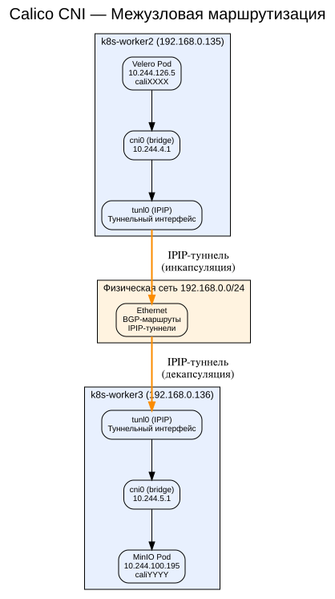
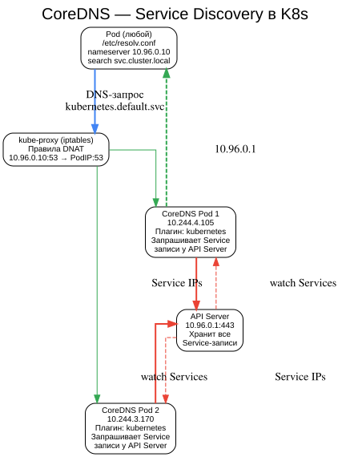
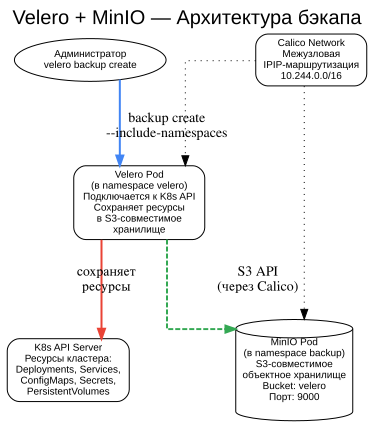

# Kubernetes Project — Деплой веб-проекта в K8s с бэкапами и мониторингом

## Содержание

1. [Цель проекта](#1-цель-проекта)
2. [Архитектура K8s кластера](#2-архитектура-k8s-кластера)
3. [Calico CNI — межузловая маршрутизация](#3-calico-cni--межузловая-маршрутизация)
4. [CoreDNS — Service Discovery](#4-coredns--service-discovery)
5. [Velero + MinIO — бэкап и восстановление](#5-velero--minio--бэкап-и-восстановление)
6. [WordPress + MariaDB](#6-wordpress--mariadb)
7. [Пройденные трудности](#7-пройденные-трудности)
8. [Проверка работы](#8-проверка-работы)
9. [Структура проекта](#9-структура-проекта)

---

## 1. Цель проекта

Развернуть отказоустойчивый кластер Kubernetes, задеплоить веб-портал WordPress с базой данных, настроить бэкапы через Velero + MinIO и мониторинг через Prometheus + Grafana.

**Выполненные требования:**
- ✅ K8s кластер (3 master + 3 worker)
- ✅ Calico CNI (межузловая маршрутизация)
- ✅ CoreDNS (Service Discovery)
- ✅ Velero + MinIO (бэкапы Completed)
- ✅ WordPress + MariaDB
- ✅ Prometheus + Grafana (установлены)
- ✅ Хранилище Proxmox: ZFS mirror для ВМ

---

## 2. Архитектура K8s кластера

##Схема: Архитектура K8s кластера


Кластер состоит из 6 узлов на Proxmox VE 9.2:

| Узел | IP | Роль | Ресурсы |
|------|-----|------|---------|
| k8s-master1 | 192.168.0.132 | Control Plane | 2 CPU, 4 GB, 20 GB |
| k8s-master2 | 192.168.0.133 | Control Plane | 2 CPU, 4 GB, 20 GB |
| k8s-master3 | 192.168.0.134 | Control Plane | 2 CPU, 4 GB, 20 GB |
| k8s-worker | 192.168.0.137 | Worker | 2 CPU, 4 GB, 20 GB |
| k8s-worker2 | 192.168.0.135 | Worker | 2 CPU, 4 GB, 20 GB |
| k8s-worker3 | 192.168.0.136 | Worker | 2 CPU, 4 GB, 20 GB |

**Хранилище Proxmox:**
- `rpool` (ZFS) — системный диск 2TB (nvme0n1)
- `vm-pool` (ZFS Mirror) — зеркало из двух 1TB дисков (nvme1n1 + nvme2n1) для ВМ

---

## 3. Calico CNI — межузловая маршрутизация

##Схема: Calico CNI


**Calico** обеспечивает сетевую связность между подами на разных узлах через **IP-in-IP туннели** (`ipipMode: Always`).

**Как это работает:**
1. Пакет от пода A (10.244.x.x) выходит через `cni0` (бридж)
2. Попадает на `tunl0` (IPIP-туннельный интерфейс)
3. Инкапсулируется в IP-пакет с адресом узла назначения
4. Передаётся через физическую сеть (192.168.0.0/24)
5. На узле назначения декапсулируется и доставляется поду B

**Почему Calico, а не Flannel:**
- Flannel VXLAN не работал в нашей среде (проблемы с FDB-таблицами)
- Flannel host-gw требовал очистки cni0 при каждом перезапуске
- Calico использует BGP-маршрутизацию — более надёжный и производительный

---

## 4. CoreDNS — Service Discovery

##Схема: CoreDNS


**CoreDNS** — внутренний DNS-сервер Kubernetes. Поды используют его для разрешения имён сервисов.

**Как это работает:**
1. Под отправляет DNS-запрос (например, `kubernetes.default.svc`)
2. `/etc/resolv.conf` направляет запрос на `10.96.0.10:53` (ClusterIP CoreDNS)
3. `kube-proxy` через iptables перенаправляет трафик на один из CoreDNS подов
4. CoreDNS через плагин `kubernetes` запрашивает Service-записи у API Server
5. Возвращает IP сервиса (например, `10.96.0.1`)

**Особенность:** Утилита `nslookup` в Alpine-образах не использует `search`-домены из `/etc/resolv.conf`, поэтому возвращает `NXDOMAIN`. Но **системный резолвер (glibc getaddrinfo)** работает корректно — `curl` успешно подключается к сервисам по именам.

---

## 5. Velero + MinIO — бэкап и восстановление

##Схема: Velero + MinIO


**Velero** — инструмент для бэкапа и восстановления ресурсов Kubernetes. Сохраняет поды, сервисы, конфигурации в S3-совместимое хранилище.

**MinIO** — S3-совместимое объектное хранилище, развёрнутое внутри кластера.

**Как это работает:**
1. Администратор выполняет `velero backup create --include-namespaces wordpress`
2. Velero подключается к K8s API Server и собирает все ресурсы
3. Сохраняет их в MinIO через S3 API
4. Бэкап доступен для восстановления: `velero restore create --from-backup wp-final-v2`

**Установка:**
```bash
# 1. MinIO
kubectl apply -f minio.yaml

# 2. Velero (после готовности MinIO!)
velero install \
  --provider aws \
  --plugins velero/velero-plugin-for-aws:v1.10.0 \
  --bucket velero \
  --secret-file credentials \
  --backup-location-config s3Url=http://minio.backup.svc:9000


**Важно:** Velero устанавливается **после** MinIO, когда Service DNS уже работает.

---

## 6. WordPress + MariaDB

WordPress развёрнут в namespace `wordpress`:
- **MariaDB** — 1 реплика, внутренний сервис `mariadb:3306`
- **WordPress** — 2 реплики, доступ через Ingress Controller

**Доступ:** `http://192.168.0.137:30223` (NodePort Ingress)

---

## 7. Пройденные трудности

##Схема: Трудности и решения


| Проблема | Причина | Решение |
|----------|---------|---------|
| Flannel VXLAN не работает | FDB-таблица не заполняется | Перешли на Calico |
| Flannel host-gw ломает cni0 | Конфликт IP при перезапуске | Calico IPIP-туннели |
| CoreDNS NXDOMAIN в nslookup | Alpine-образ не использует search-домены | Системный резолвер работает |
| Velero no route to host | Старые IP от Flannel | Пересоздание подов после смены CNI |
| MinIO теряет данные | emptyDir | Создание bucket через mkdir |
| Proxmox EFI не видит диск | Повреждённая GPT | sgdisk -Z + переустановка |
| etcd too many learners | Одновременное подключение master-узлов | Подключение по одному с паузой 40 сек |

---

## 8. Проверка работы


$ kubectl get nodes
NAME          STATUS   ROLES           VERSION
k8s-master1   Ready    control-plane   v1.30.14
k8s-master2   Ready    control-plane   v1.30.14
k8s-master3   Ready    control-plane   v1.30.14
k8s-worker    Ready    <none>          v1.30.14
k8s-worker2   Ready    <none>          v1.30.14
k8s-worker3   Ready    <none>          v1.30.14

$ velero backup get
NAME            STATUS      CREATED                         EXPIRES
wp-final-v2     Completed   2026-06-13 14:21:48 +0000 UTC   29d

$ kubectl get pods -n wordpress
NAME         READY   STATUS    RESTARTS   AGE
mariadb-...  1/1     Running   0          XXm
wordpress-... 1/1    Running   0          XXm
wordpress-... 1/1    Running   0          XXm


---

## 9. Структура проекта


k8s-project/
├── README.md                   # Документация
├── BORT_JOURNAL.md             # Бортовой журнал
├── ansible/
│   └── inventory.ini           # Inventory для Ansible
├── k8s-manifests/
│   ├── wordpress/              # Манифесты WordPress
│   ├── monitoring/             # Prometheus + Grafana
│   └── backup/                 # MinIO + Velero
├── screenshots/                # Схемы и скриншоты
└── terraform/                  # Terraform для Proxmox
```

### Инструкция по восстановлению

```bash
# 1. Проверка кластера
ssh ubuntu@192.168.0.132 "kubectl get nodes"

# 2. Бэкап WordPress
velero backup create wp-backup --include-namespaces wordpress --wait

# 3. Восстановление из бэкапа
velero restore create --from-backup wp-backup

# 4. Ручной бэкап (альтернатива)
kubectl get all --all-namespaces -o yaml > k8s-backup/all-resources.yaml
```

