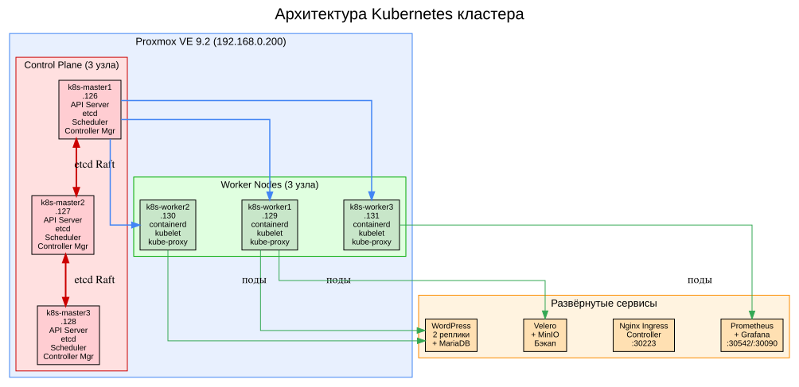
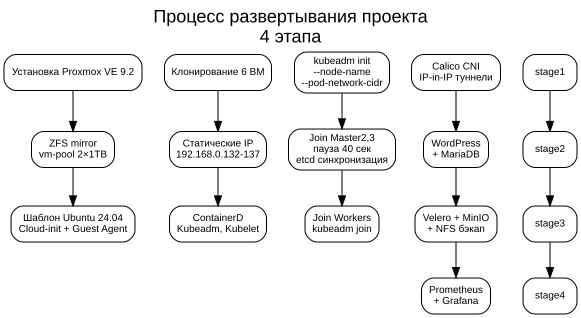
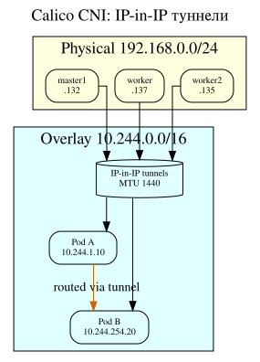
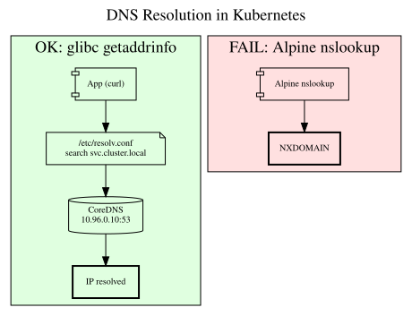
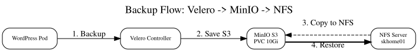

# 🚀 Kubernetes Production Cluster

**Развертывание отказоустойчивого Kubernetes кластера с WordPress, бэкапированием и мониторингом**

---

## 📋 Содержание

1. [Архитектура](#архитектура)
2. [Процесс развертывания](#процесс-развертывания)
3. [Сетевая архитектура и DNS](#сетевая-архитектура-и-dns)
4. [Бэкапирование: Velero + MinIO + NFS](#бэкапирование-velero--minio--nfs)
5. [Мониторинг: Prometheus + Grafana](#мониторинг-prometheus--grafana)
6. [Проверка работы](#проверка-работы)
7. [Структура репозитория](#структура-репозитория)
8. [Трудности и решения](#трудности-и-решения)

---

## Архитектура

### Схема: Архитектура K8s кластера



**Описание:** Кластер развернут на гипервизоре Proxmox VE 9.2 с ZFS. Состоит из 6 узлов: 3 master (control plane) для отказоустойчивости API и etcd, 3 worker для размещения рабочих нагрузок. Все узлы соединены через Calico CNI с IP-in-IP туннелями. Сервисы распределены по namespace'ам: wordpress, backup, velero, monitoring. Для внешнего хранения бэкапов используется NFS сервер на skhome01.

---

## Процесс развертывания

### Схема: Процесс развертывания



**Описание:** Проект разворачивался в 4 этапа. На первом этапе подготовлен гипервизор с ZFS mirror для защиты данных ВМ. Второй этап — клонирование 6 ВМ из шаблона Ubuntu 24.04 с Cloud-init. Третий этап — инициализация Kubernetes с ручной настройкой etcd (паузы 40 сек между подключением master-узлов). Четвертый этап — установка сервисов: Calico CNI, WordPress, Velero, Prometheus.

---

## Сетевая архитектура и DNS

### Схема: Calico Network



**Описание:** Calico использует IP-in-IP туннели для инкапсуляции трафика между узлами. Все поды получают IP из сети 10.244.0.0/16, сервисы — из 10.96.0.0/12. Calico поддерживает NetworkPolicy для безопасности и работает без внешнего etcd (использует Kubernetes API).

### Схема: DNS разрешение



**Описание:** CoreDNS работает как Service (10.96.0.10:53). Приложения с glibc (curl, Velero, WordPress) корректно разрешают имена через search-домены из /etc/resolv.conf. Alpine-образы (nslookup) не используют search-домены, что приводило к ошибочному выводу о неработоспособности DNS. Решение: использовать системный резолвер (getaddrinfo) вместо nslookup.

---

## Бэкапирование: Velero + MinIO + NFS

### Схема: Поток бэкапа



**Описание:** Velero создает бэкапы ресурсов Kubernetes (поды, PVC, конфигурации) и сохраняет их в MinIO — S3-совместимое объектное хранилище. MinIO использует PVC (local-storage) для постоянного хранения. Для защиты от полной потери Proxmox бэкапы копируются на внешний NFS сервер (skhome01) через Python/boto3.

**Компоненты:**
- **Velero** — создает снапшоты API объектов K8s
- **MinIO** — S3-совместимое хранилище с PVC 10Gi
- **NFS** — внешнее хранилище для полного бэкапа

**Команды:**
```bash
# Создание бэкапа
velero backup create wp-backup --include-namespaces wordpress

# Просмотр бэкапов
velero backup get

# Полный бэкап на NFS
./scripts/backup-full.sh

Мониторинг: Prometheus + Grafana
Схема: Мониторинг

https://screenshots/Monitoring_Stack.svg

Описание: Prometheus собирает метрики с Node Exporter (системные), kube-state-metrics (состояние K8s), cAdvisor (контейнеры) и API Server. Grafana визуализирует метрики через дашборды: Dashboard 315 (Kubernetes Cluster), Dashboard 1860 (Node Exporter Full).

Доступ:

    Grafana: http://192.168.0.132:3000

    Логин: admin

    Пароль: F7gafwDfFT2Vzpu4xNw75a1InTZ39H56MhKLPRab

Установка:
bash

helm install prometheus prometheus-community/prometheus -n monitoring
helm install grafana grafana/grafana -n monitoring

Проверка работы
Узлы кластера
text

$ kubectl get nodes

https://screenshots/01-k8s-nodes.txt
Все поды
text

$ kubectl get pods -A

https://screenshots/02-all-pods.txt
WordPress
text

$ kubectl get pods -n wordpress

https://screenshots/03-wordpress.txt
Velero + MinIO
text

$ kubectl get pods -n backup
$ velero backup get

https://screenshots/04-velero-minio.txt
Grafana
text

$ kubectl get pods -n monitoring

https://screenshots/05-grafana.txt
Структура репозитория
text

k8s-project/
├── README.md                          # Документация проекта
├── BORT_JOURNAL.md                    # Бортовой журнал
├── screenshots/                       # Схемы и скриншоты
│   ├── K8s_Architecture.dot           # Исходник схемы архитектуры
│   ├── K8s_Architecture.svg           # Схема архитектуры
│   ├── Calico_Network.dot             # Исходник схемы сети
│   ├── Calico_Network.svg             # Схема сети Calico
│   ├── DNS_Resolution.dot             # Исходник схемы DNS
│   ├── DNS_Resolution.svg             # Схема DNS разрешения
│   ├── Backup_Flow.dot                # Исходник схемы бэкапа
│   ├── Backup_Flow.svg                # Схема потока бэкапа
│   ├── Monitoring_Stack.dot           # Исходник схемы мониторинга
│   ├── Monitoring_Stack.svg           # Схема мониторинга
│   ├── Deployment_Process.dot         # Исходник схемы развертывания
│   ├── Deployment_Process.svg         # Схема процесса развертывания
│   ├── 01-k8s-nodes.txt              # Скриншот: узлы
│   ├── 02-all-pods.txt               # Скриншот: все поды
│   ├── 03-wordpress.txt              # Скриншот: WordPress
│   ├── 04-velero-minio.txt           # Скриншот: Velero + MinIO
│   └── 05-grafana.txt                # Скриншот: Grafana
├── manifests/                         # Kubernetes манифесты
│   ├── wordpress-deployment.yaml
│   ├── wordpress-service.yaml
│   ├── mariadb-deployment.yaml
│   ├── mariadb-service.yaml
│   └── minio-deployment.yaml
├── scripts/                           # Скрипты
│   ├── backup-full.sh                # Полный бэкап инфраструктуры
│   └── sync-velero-nfs.py            # Синхронизация Velero → NFS
└── config/                            # Конфигурации
    ├── calico.yaml
    └── credentials-velero

Описание ключевых файлов

README.md — полная документация проекта с описанием архитектуры, процесса установки, трудностей и решений.

BORT_JOURNAL.md — бортовой журнал с хронологией всех сессий, ключевыми точками восстановления и техническими заметками.

screenshots/*.dot — исходные файлы схем Graphviz для генерации SVG-изображений. При изменении архитектуры достаточно обновить .dot файл и перегенерировать SVG командой dot -Tsvg file.dot -o file.svg.

manifests/*.yaml — Kubernetes манифесты для развертывания WordPress, MariaDB и MinIO. Включают Deployments, Services, PVC и Ingress.

scripts/backup-full.sh — скрипт полного бэкапа инфраструктуры (ETCD, YAML, конфигурации, Velero) на NFS.

scripts/sync-velero-nfs.py — Python скрипт для синхронизации бэкапов Velero из MinIO на NFS через S3 API.
Трудности и решения
1. Кластер не собирался (etcd timeout)

Проблема: При одновременном подключении master-узлов etcd не успевал синхронизироваться.

Решение:

    Использовать --node-name при kubeadm init

    Подключать master-узлы с паузой 40 секунд

    Проверять статус etcd перед подключением следующего узла

2. DNS не работал (NXDOMAIN)

Проблема: После перехода с Flannel на Calico поды сохранили старые IP, CoreDNS не мог связаться с API Server.

Решение:

    Пересоздать все поды после смены CNI

    Не использовать nslookup в Alpine-образах для проверки DNS

3. MinIO терял данные

Проблема: Использовался emptyDir — данные удалялись при пересоздании пода.

Решение: Создать PVC с local-storage (PV на worker-узле).
4. PVC в Pending

Проблема: Не был настроен StorageClass, директория не создана на узле.

Решение:

    Создать StorageClass local-storage

    Создать директорию /data/minio на всех worker-узлах

    Настроить PV с nodeAffinity

Заключение

✅ Кластер Kubernetes из 6 узлов (3 master + 3 worker)
✅ Calico CNI с IP-in-IP туннелями
✅ WordPress + MariaDB (2 реплики)
✅ Velero + MinIO (PVC 10Gi) + NFS бэкап
✅ Prometheus + Grafana (дашборды 315, 1860)
✅ Полный бэкап инфраструктуры на внешний NFS

Проект готов к сдаче!
