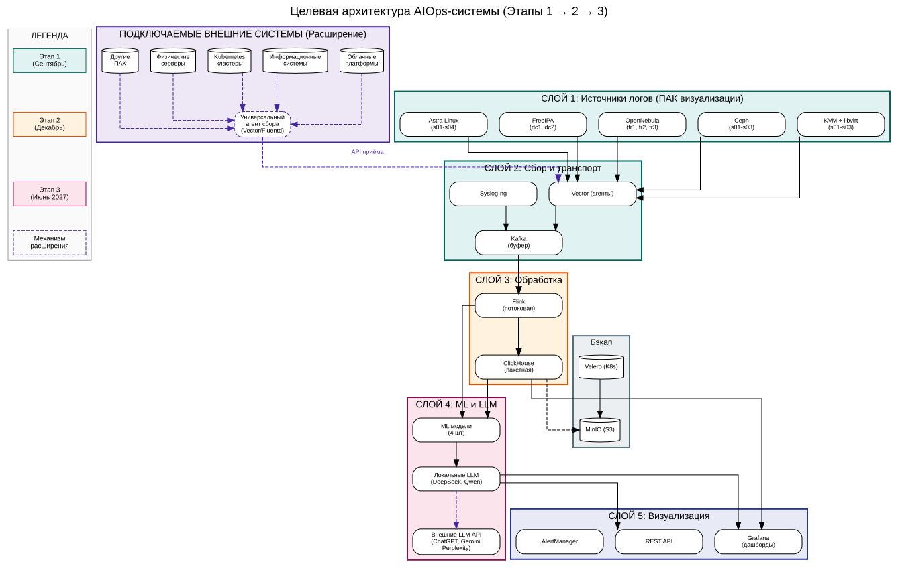
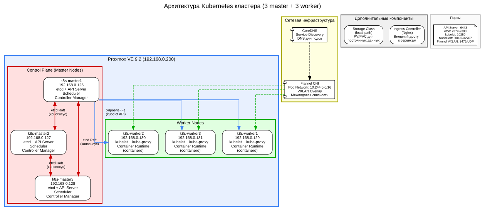

# Kubernetes Project — Этап 1: Подготовка Proxmox

## Выполненные шаги

### 1. Очистка Proxmox
Удалены все старые ВМ, очищены хранилища ISO и snippets.

### 2. Настройка Cloud-init и Guest Agent
- Создан snippets storage для cloud-init
- Скачан Ubuntu 24.04 Cloud Image
- Создан шаблон ВМ (ID 9000) с предустановленным Guest Agent
- Cloud-init настроен на автоматическую установку пакетов и запуск сервисов

### 3. Тестовая ВМ
- Клонирована тестовая ВМ (ID 100) из шаблона
- Guest Agent работает
- Cloud-init успешно выполнил настройку

## Структура проекта
```
k8s-project/
├── README.md
├── screenshots/
├── terraform/
├── ansible/
└── k8s-manifests/
```

---

## Целевая архитектура AIOps-системы

Принята на сессии 12 июня 2026.



### Легенда (цвета этапов)

| Цвет | Этап | Срок |
|------|------|------|
| 🟢 Зелёный | Этап 1: Фундамент | 1 сентября 2026 |
| 🟠 Оранжевый | Этап 2: AIOps пилот | 1 декабря 2026 |
| 🩷 Розовый | Этап 3: Диссертация | 1 июня 2027 |
| 🟣 Фиолетовый пунктир | Механизм расширения | По мере подключения |

### 5 слоёв системы

**Слой 1: Источники логов (ПАК визуализации)**
- Astra Linux (s01-s04): syslog, kern.log, auth.log, journald
- FreeIPA (dc1, dc2): ipactl, bind9, krb5kdc, dirsrv
- OpenNebula (fr1, fr2, fr3): oned.log, sunstone, RAFT
- Ceph (s01-s03): ceph status, OSD, MON, MGR
- KVM + libvirt (s01-s03): libvirtd.log, qemu, статусы ВМ

**Слой 2: Сбор и транспорт**
- Vector (агенты) / Syslog-ng (центральный приёмник)
- Kafka (буфер сообщений, 3 брокера)

**Слой 3: Обработка**
- Flink (потоковая): парсинг → аномалии → агрегация
- ClickHouse (пакетная): raw_logs → metrics → anomalies

**Слой 4: ML и LLM аналитика**
- ML модели: Isolation Forest, Random Forest, Prophet, K-Means
- Локальные LLM: DeepSeek, Qwen (первичный анализ)
- Внешние LLM API: ChatGPT, Perplexity, Gemini, DeepSeek (верификация)

**Слой 5: Визуализация и действия**
- Grafana (дашборды и алерты)
- REST API (интеграция с внешними системами)
- AlertManager (уведомления в Telegram, почту)

### Механизм расширения

Любая внешняя система (облачные платформы, ИС, K8s-кластеры, физические серверы, другие ПАК) подключается через **универсальный агент** (Vector/Fluentd). Агент отправляет логи в общий пайплайн через API приёма. Все компоненты обработки работают с логами любых источников без изменений — на этапе парсинга логи приводятся к единой схеме.

### Подключаемые LLM

Локальные модели (DeepSeek, Qwen) выполняют первичный анализ. Для сложных запросов или верификации запрос автоматически направляется к внешним API (ChatGPT, Perplexity, Gemini). Замена локальной модели производится через конфигурацию без изменения кода.


---

## Архитектура Kubernetes кластера



### Структура кластера

Кластер состоит из **6 узлов** (виртуальных машин), развёрнутых в Proxmox VE 9.2:

| Узел | IP | Роль | Ресурсы |
|------|-----|------|---------|
| k8s-master1 | 192.168.0.126 | Control Plane | 2 CPU, 4 GB RAM, 20 GB disk |
| k8s-master2 | 192.168.0.127 | Control Plane | 2 CPU, 4 GB RAM, 20 GB disk |
| k8s-master3 | 192.168.0.128 | Control Plane | 2 CPU, 4 GB RAM, 20 GB disk |
| k8s-worker1 | 192.168.0.129 | Worker | 2 CPU, 4 GB RAM, 20 GB disk |
| k8s-worker2 | 192.168.0.130 | Worker | 2 CPU, 4 GB RAM, 20 GB disk |
| k8s-worker3 | 192.168.0.131 | Worker | 2 CPU, 4 GB RAM, 20 GB disk |

### Как устроен и как работает

**Control Plane (Master-узлы)** — управляющий слой кластера. Три мастер-узла образуют отказоустойчивый кластер etcd (распределённое key-value хранилище конфигурации) на основе алгоритма консенсуса Raft. Для принятия решения требуется кворум ≥ 2 из 3 узлов. При отказе одного мастера кластер продолжает работу. Основные компоненты:

- **etcd** — распределённое хранилище всей конфигурации кластера
- **API Server (kube-apiserver)** — центральный управляющий компонент, принимает REST-запросы от kubectl и внутренних компонентов
- **Scheduler (kube-scheduler)** — распределяет поды по worker-узлам на основе доступных ресурсов
- **Controller Manager (kube-controller-manager)** — поддерживает желаемое состояние кластера (Deployment, ReplicaSet, и т.д.)

**Worker-узлы** — исполняющий слой, где запускаются контейнеры приложений:

- **kubelet** — агент, который получает команды от API Server и управляет подами
- **kube-proxy** — сетевой прокси, настраивает правила iptables/IPVS для доступа к сервисам
- **Container Runtime (containerd)** — среда выполнения контейнеров

**Сетевая инфраструктура:**

- **Flannel CNI** — обеспечивает единую сеть для всех подов (10.244.0.0/16) через VXLAN-туннели. Каждый под получает уникальный IP и может общаться с любым другим подом в кластере.
- **CoreDNS** — внутренний DNS-сервер кластера. Поды находят друг друга по именам сервисов (например, `wordpress.default.svc.cluster.local`).

**Как происходит деплой приложения:**

1. Пользователь выполняет `kubectl apply -f deployment.yaml`
2. API Server принимает запрос и сохраняет конфигурацию в etcd
3. Scheduler находит подходящий worker-узел для новых подов
4. Controller Manager создаёт ReplicaSet, который запускает поды
5. kubelet на worker-узле получает команду и запускает контейнеры через containerd
6. kube-proxy настраивает сетевые правила для доступа к подам через Service

### Отказоустойчивость

- **Отказ worker-узла:** поды автоматически перезапускаются на других worker-узлах
- **Отказ одного master-узла:** кластер продолжает работу (кворум etcd 2 из 3 сохранён)
- **Отказ двух master-узлов:** кластер переходит в режим read-only (потеря кворума)
