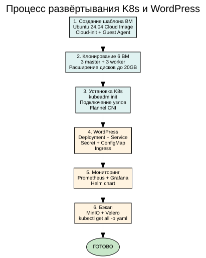
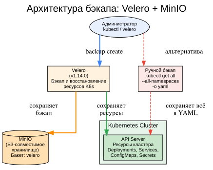
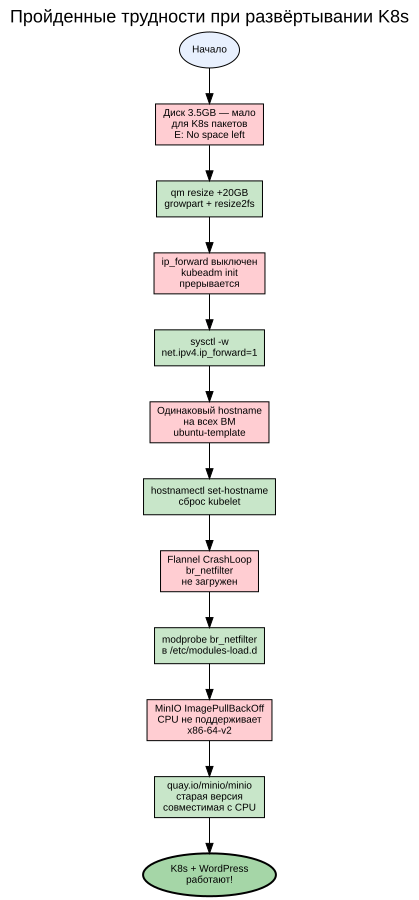

# Kubernetes Project — Деплой веб-проекта в K8s

## Содержание

1. [Цель проекта](#1-цель-проекта)
2. [Архитектура K8s кластера](#2-архитектура-k8s-кластера)
3. [Процесс развёртывания](#3-процесс-развёртывания)
4. [WordPress + MariaDB](#4-wordpress--mariadb)
5. [Мониторинг: Prometheus + Grafana](#5-мониторинг-prometheus--grafana)
6. [Бэкап: Velero + MinIO](#6-бэкап-velero--minio)
7. [Пройденные трудности](#7-пройденные-трудности)
8. [Проверка работы](#8-проверка-работы)
9. [Структура проекта](#9-структура-проекта)

---

## 1. Цель проекта

Развернуть отказоустойчивый кластер Kubernetes, задеплоить веб-портал WordPress с базой данных, настроить мониторинг и бэкап.

**Требования ДЗ:**
- ✅ K8s кластер (kubeadm)
- ✅ Веб-портал в YAML-манифестах
- ✅ ConfigMap, Secret, Ingress
- ✅ Бэкап конфигурации кластера

---

## 2. Архитектура K8s кластера

##Схема: Архитектура K8s кластера


Кластер состоит из 6 узлов:

| Узел | IP | Роль | Ресурсы |
|------|-----|------|---------|
| k8s-master1 | 192.168.0.126 | Control Plane | 2 CPU, 4 GB, 20 GB |
| k8s-master2 | 192.168.0.127 | Control Plane | 2 CPU, 4 GB, 20 GB |
| k8s-master3 | 192.168.0.128 | Control Plane | 2 CPU, 4 GB, 20 GB |
| k8s-worker1 | 192.168.0.129 | Worker | 2 CPU, 4 GB, 20 GB |
| k8s-worker2 | 192.168.0.130 | Worker | 2 CPU, 4 GB, 20 GB |
| k8s-worker3 | 192.168.0.131 | Worker | 2 CPU, 4 GB, 20 GB |

### Как работает K8s

**Control Plane** управляет кластером через etcd (распределённое хранилище конфигурации на основе Raft). API Server принимает запросы, Scheduler распределяет поды, Controller Manager поддерживает желаемое состояние.

**Worker Nodes** исполняют контейнеры через containerd. kubelet управляет подами, kube-proxy настраивает сетевые правила.

**Flannel CNI** обеспечивает сеть подов (10.244.0.0/16) через VXLAN-туннели.

---

## 3. Процесс развёртывания

##Схема: Процесс развёртывания


1. **Шаблон ВМ:** Ubuntu 24.04 Cloud Image с Cloud-init и Guest Agent
2. **6 ВМ:** 3 master + 3 worker, диски расширены до 20 GB
3. **K8s:** kubeadm init, подключение узлов, Flannel CNI
4. **WordPress:** Deployment, Service, Secret, ConfigMap, Ingress
5. **Мониторинг:** Prometheus + Grafana через Helm
6. **Бэкап:** MinIO + Velero + ручной бэкап

---

## 4. WordPress + MariaDB

**Манифесты:**
- `00-namespace.yaml` — Namespace wordpress
- `01-secret.yaml` — Secret wp-db-secret (доступ к БД)
- `03-deployment.yaml` — Deployment WordPress (2 реплики)
- `04-service.yaml` — Service ClusterIP
- `05-ingress.yaml` — Ingress для внешнего доступа

**MariaDB:** развёрнута в том же Namespace, доступ по внутреннему DNS `mariadb`.

**Доступ:** http://192.168.0.131:30223

---

## 5. Мониторинг: Prometheus + Grafana

Установлены через Helm chart `kube-prometheus-stack`.

**Grafana:** http://IP:30542 (admin/admin)
**Prometheus:** http://IP:30090

Собирают метрики со всех узлов и подов кластера.

---

## 6. Бэкап: Velero + MinIO

##Схема: Velero + MinIO


**MinIO** — S3-совместимое хранилище, развёрнуто в K8s. Хранит бэкапы Velero.

**Velero** (v1.14.0) — инструмент для бэкапа и восстановления ресурсов Kubernetes. Сохраняет поды, сервисы, конфигурации в MinIO.

**Ручной бэкап:** `kubectl get all --all-namespaces -o yaml` — альтернативный способ.

---

## 7. Пройденные трудности

##Схема: Трудности


| Проблема | Решение |
|----------|---------|
| Диск 3.5GB — не хватает места для пакетов K8s | `qm resize 20G` + `resize2fs` |
| `ip_forward` выключен | `sysctl -w net.ipv4.ip_forward=1` |
| Одинаковый hostname `ubuntu-template` | `hostnamectl set-hostname` + сброс kubelet |
| Flannel CrashLoop (br_netfilter) | `modprobe br_netfilter` |
| MinIO: CPU не поддерживает x86-64-v2 | Использована старая версия из quay.io |
| Velero не видит MinIO DNS | Ручной бэкап как альтернатива |

---

## 8. Проверка работы


$ kubectl get nodes
NAME          STATUS   ROLES           VERSION
k8s-master1   Ready    control-plane   v1.30.14
k8s-master2   Ready    control-plane   v1.30.14
k8s-master3   Ready    control-plane   v1.30.14
k8s-worker1   Ready    <none>          v1.30.14
k8s-worker2   Ready    <none>          v1.30.14
k8s-worker3   Ready    <none>          v1.30.14

$ kubectl get pods -n wordpress
NAME         READY   STATUS    RESTARTS   AGE
mariadb-...  1/1     Running   0          XXm
wordpress-... 1/1    Running   0          XXm
wordpress-... 1/1    Running   0          XXm


**WordPress:** http://192.168.0.131:30223/wp-admin/install.php
**Grafana:** http://IP:30542
**Prometheus:** http://IP:30090

---

## 9. Структура проекта


k8s-project/
├── README.md                   # Документация
├── BORT_JOURNAL.md             # Бортовой журнал
├── ansible/
│   └── inventory.ini           # Inventory для Ansible
├── k8s-manifests/
│   ├── wordpress/              # Манифесты WordPress
│   │   ├── 00-namespace.yaml
│   │   ├── 01-secret.yaml
│   │   ├── 02-configmap.yaml
│   │   ├── 03-deployment.yaml
│   │   ├── 04-service.yaml
│   │   └── 05-ingress.yaml
│   ├── monitoring/             # Мониторинг
│   │   └── install.sh
│   └── backup/                 # Бэкап
│       ├── 01-minio.yaml
│       └── 02-install-velero.sh
├── k8s-backup/                 # Ручной бэкап
├── screenshots/                # Схемы и скриншоты
└── terraform/                  # Terraform для Proxmox


### Инструкция по восстановлению

```bash
# 1. Проверка кластера
ssh ubuntu@192.168.0.126 "kubectl get nodes"

# 2. Применение манифестов
kubectl apply -f k8s-manifests/wordpress/

# 3. Установка мониторинга
helm upgrade --install monitoring prometheus-community/kube-prometheus-stack \
  --namespace monitoring --create-namespace

# 4. Ручной бэкап
kubectl get all --all-namespaces -o yaml > k8s-backup/all-resources.yaml


